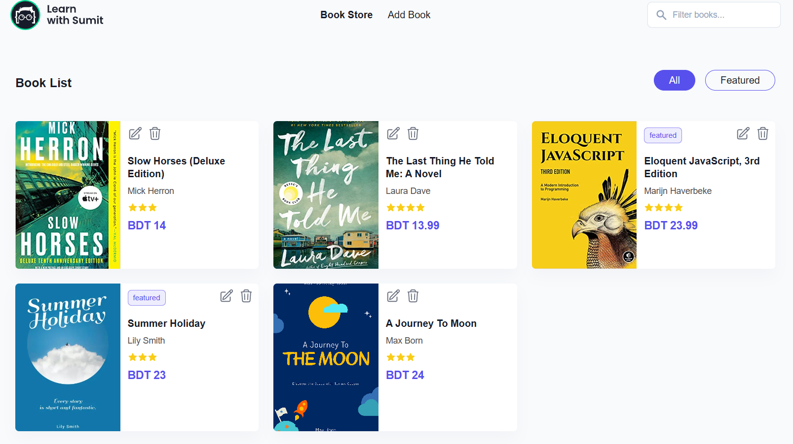
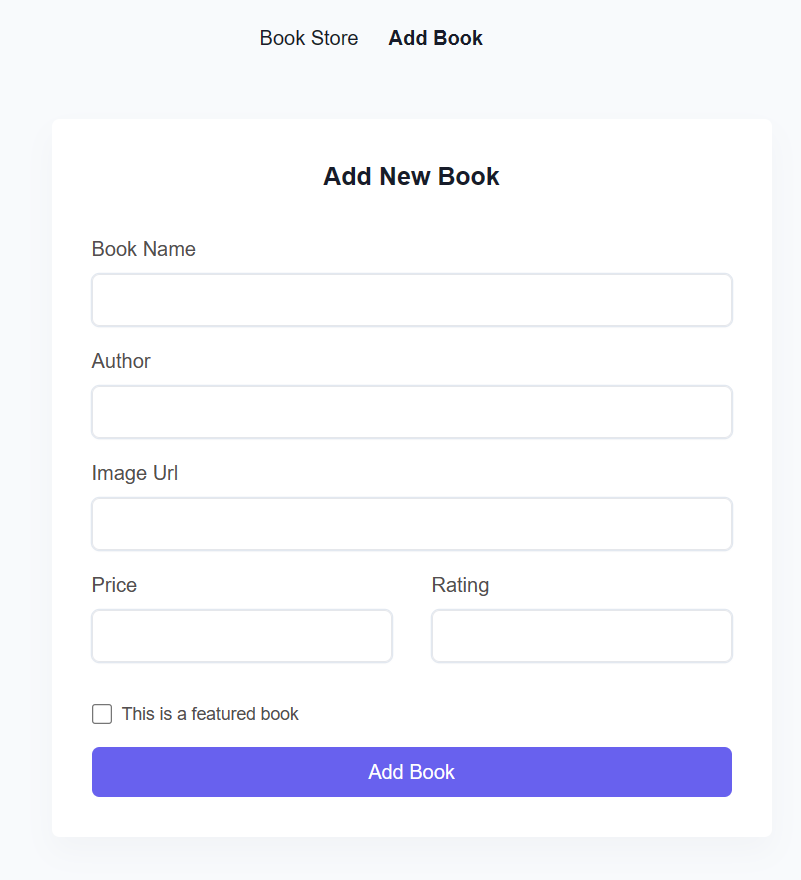
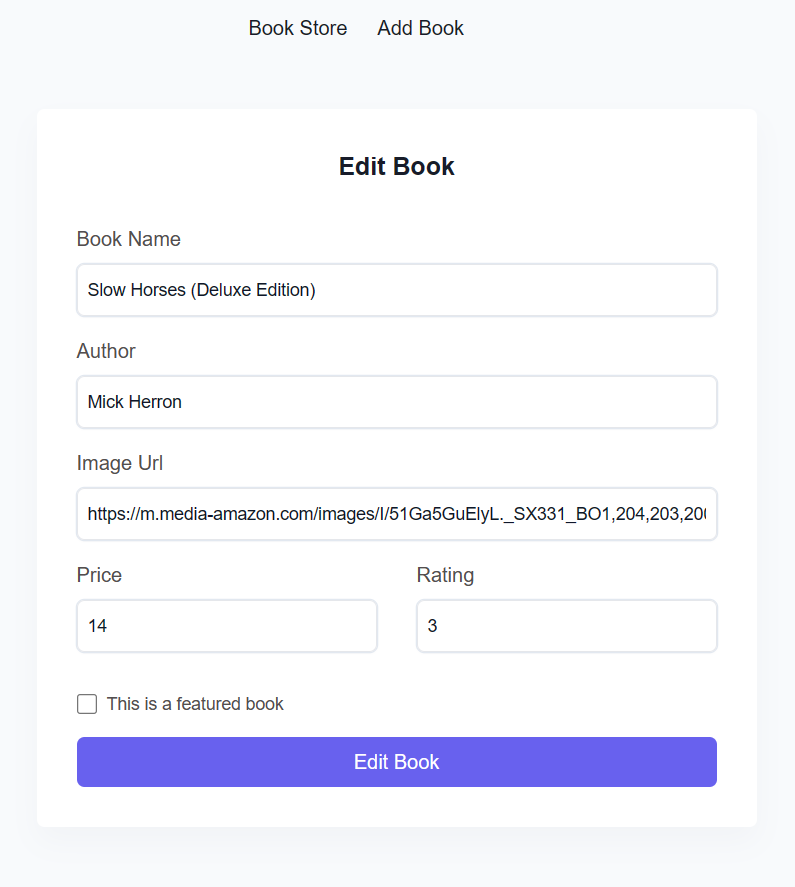

## Book List Application

### Live Preview [Preview](https://lws-bookstorertkq.netlify.app/)

### Technologies used in this application

    🠪 JavaScript
    🠪 ReactJs
    🠪 Redux-toolkit
    🠪 React router dom (for routing purposes)

### Functionality

✓ Fetch all the books from the database and render them into the home page

✓ You can filter 'All' or 'Featured' books and also you can search the books or book by the book name

✓ You can also add ,edit and remove books from the database and render them into the home page according to operations.

> **Note**
> In this project the server are used is a dummy local server.To start the server you have to download the "server" folder add install node dependency (e.x npm install) then start the server (e.x npm start).

### Web page screenshot

 <!-- <table border="0">
    <tr border="0">
        <td>Home Page</td>
    </tr>
    <tr>
        <td></td>
    </tr>
     <tr>
        <td>Add Page</td>
        <td>Edit Page</td>
    </tr>
    <tr>
        <td></td>
        <td></td>
    </tr> 
</table>  -->

| Home Page                                                            |
| -------------------------------------------------------------------- |
|  |

| Add Page                                                            | Edit Page                                                            |
| ------------------------------------------------------------------- | -------------------------------------------------------------------- |
|  |  |
